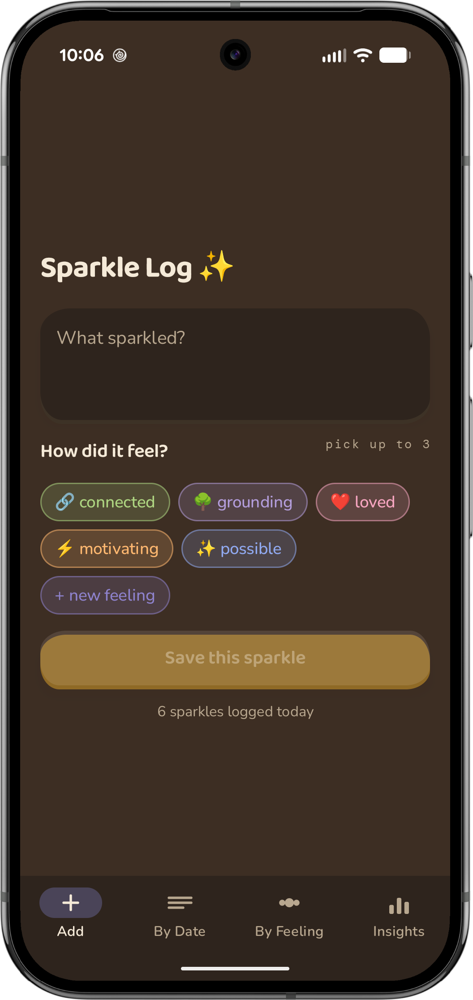
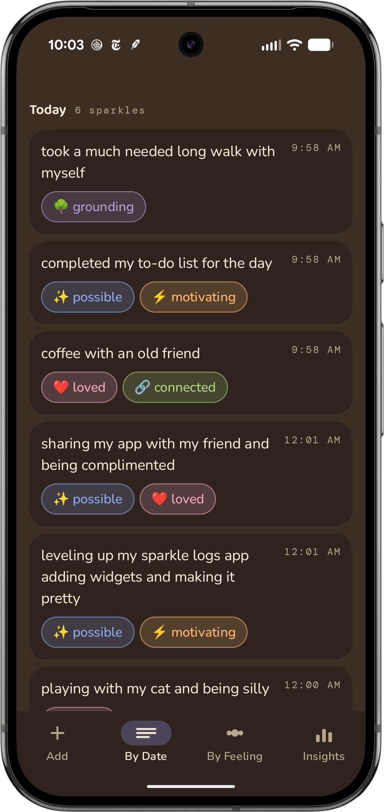
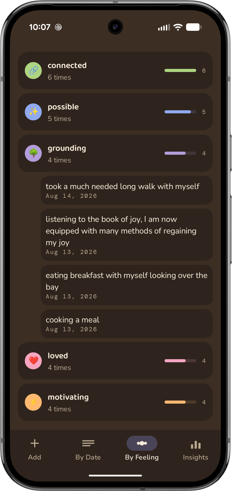
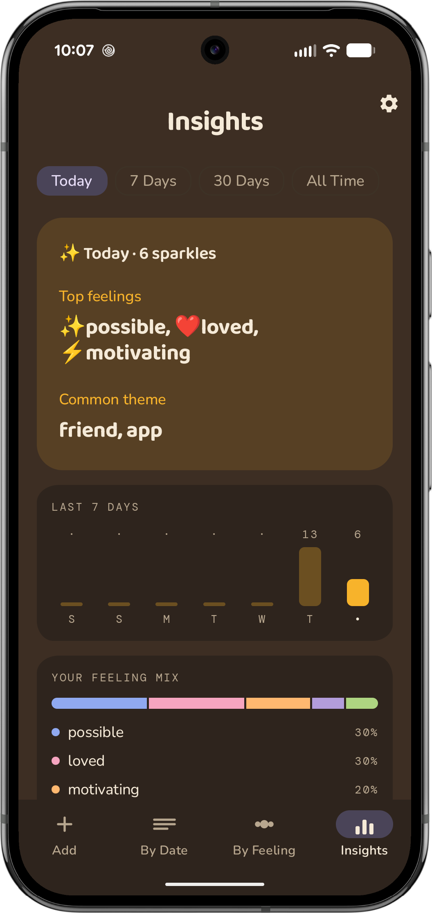
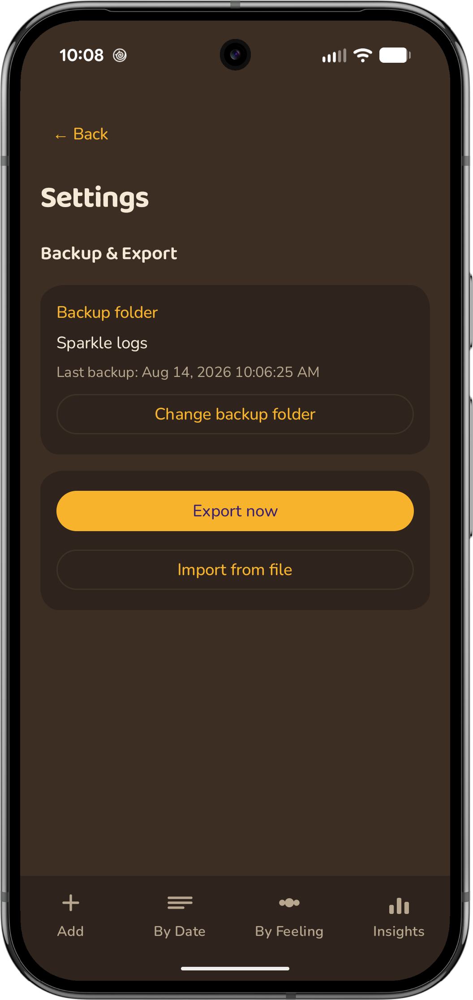

# Sparkle Log ✨

A simple Android app for logging small moments of fulfillment ("sparkles") during your day — what happened, and how it made you feel.

    

## Features

- **Add** — log an event/moment and tag it with up to 3 feelings. Feelings start as free text; once created, they show up as reusable colored chips (with an emoji if you gave them one) so you never retype them. A new-feeling flow lets you pick a color and emoji on the spot.
- **By Date** — browse sparkles chronologically, grouped by day, showing every feeling tagged on each entry. Tap an entry to edit its text/feelings or delete it.
- **By Feeling** — see every feeling ranked by how often it comes up, with a relative-frequency bar; tap into one to see just those entries.
- **Insights** — pick a period (Today / 7 Days / 30 Days / All Time) to see an insight card with your top feelings and a "common theme" — a handful of words that keep recurring across that period's sparkle text (a simple on-device keyword-recurrence heuristic, not AI — only shown once you've logged at least 3 sparkles in the period, so it's not guessing off too little data). Below that: a 7-day activity bar chart and a feeling-mix breakdown.
- **Settings** (gear icon on Insights) — back up your data automatically: pick a folder once (can be a folder inside Google Drive, since the Drive app exposes itself as a normal folder picker target — no sign-in needed) and the app silently keeps one rolling `sparkle_log_backup.json` there, updated a few seconds after any change plus a daily safety-net pass around 2am. "Export now" shares a JSON snapshot through the normal Android share sheet any time; "Import from file" restores from a previously exported file (replaces all current data, with a confirmation first).
- **Home screen widgets** — *Add Sparkle* (tap to jump straight into logging) and *Today's Insight* (today's top feelings + theme at a glance, refreshes automatically as you log).

Everything is stored on-device with Room (SQLite) — no server, no account, fully offline. Backups are files you control; nothing is ever sent to a remote server.

## Tech

Kotlin, Jetpack Compose (Material 3), Room (multi-feeling tagging via a join table), Navigation-Compose, Jetpack Glance (widgets), WorkManager (scheduled backup), kotlinx.serialization (backup format), MVVM (`SparkleViewModel` + `SparkleRepository`). Custom type/color/shape system (Baloo 2 / Nunito / DM Mono fonts, warm cream-and-dark palette, organic asymmetric-corner shapes). minSdk 26, targetSdk 35.

## Opening the project

1. Open Android Studio → **Open** → select the `sparkle_logs` folder.
2. Let Gradle sync finish (it'll fetch the SDK/dependencies automatically).
3. Run on an emulator or physical device via the ▶ Run button.

## Manual test checklist

- Add a sparkle with a brand-new feeling → confirm you can pick its color/emoji and it appears as a chip afterward.
- Add a sparkle tagged with 2–3 feelings at once → confirm all of them show up on **By Date** and **By Feeling**.
- Edit and delete an entry from **By Date**.
- On **Insights**, switch periods and confirm the top-feelings/common-theme card and charts update; log fewer than 3 sparkles in a period and confirm it shows the "not enough yet" state instead of a theme.
- In **Settings**, set a backup folder, confirm a backup file appears there shortly after adding a sparkle, then use **Export now** and **Import from file** to round-trip your data.
- Add both home screen widgets; confirm the Add widget opens straight to the Add screen and the Insight widget updates after you log something.
